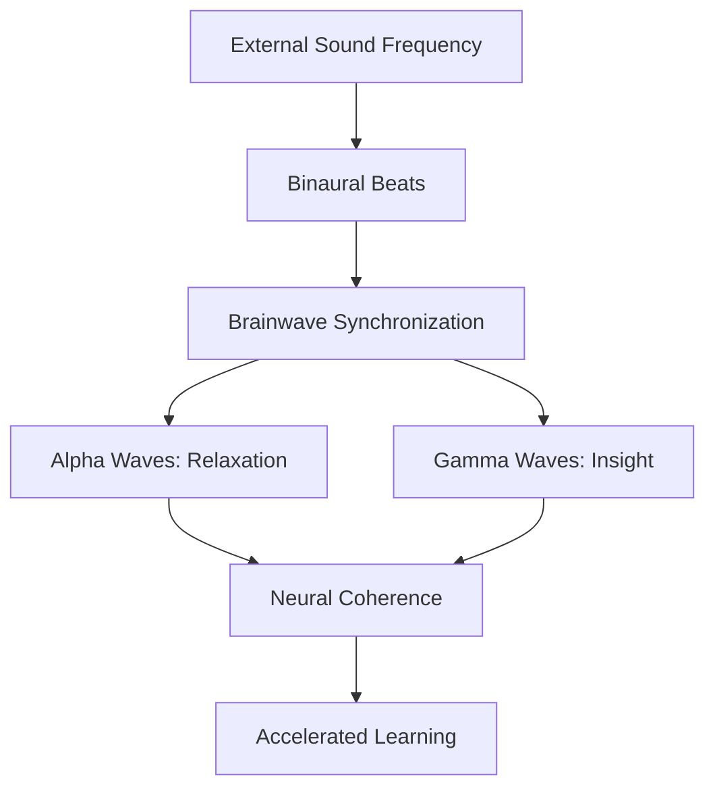
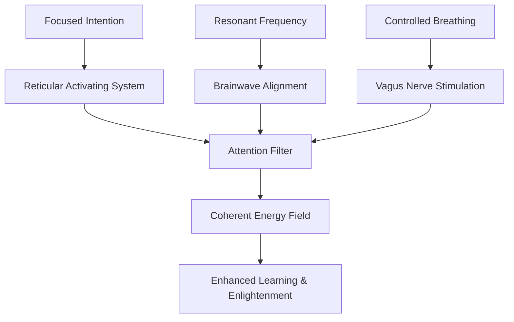

# Enlightenment Protocol: A Step-by-Step Guide to Memory Enhancement, Focus, Concentration, and Spiritual Awakening

## Introduction

This protocol integrates ancient wisdom from Eastern traditions (such as Yoga, Buddhism, and Taoism) with modern scientific understanding, including quantum physics principles, to enhance memory, focus, concentration, and achieve spiritual enlightenment. By combining meditation, controlled breathing techniques, sound frequency exposure, and electromagnetic energy balancing, participants can create coherence in their biological systems, accelerate learning, stimulate neural pathways, and tap into the full potential of the human mind and body.

Scientific foundations include:
- **Neuroplasticity**: The brain's ability to reorganize itself, enhanced through consistent practice.
- **Quantum Coherence**: Concepts from quantum biology suggest that consciousness may arise from coherent quantum states in neural microtubules (Penrose-Hameroff theory).
- **Electromagnetic Fields**: The body generates electromagnetic fields that can be harmonized for optimal function.
- **Binaural Beats and Sound Therapy**: Research shows these can entrain brainwaves for improved cognition.

Ancient wisdom draws from:
- **Yoga Pranayama**: Breathing techniques for energy control.
- **Buddhist Meditation**: Mindfulness for mental clarity.
- **Taoist Practices**: Balancing yin-yang energies.

## Prerequisites
- Quiet, distraction-free environment
- Comfortable seating (floor or chair)
- Optional: Binaural beats audio files, meditation cushion
- Commitment to daily practice (20-60 minutes)

## Step 1: Preparation and Electromagnetic Energy Balancing

**Objective**: Align the body's electromagnetic fields and create a foundation for coherence.

**Ancient Wisdom**: In Taoist practices, this is akin to balancing qi (life energy) through the body's meridians.

**Scientific Basis**: The heart generates the strongest electromagnetic field in the body. Studies show coherent heart rhythms improve cognitive function and emotional regulation (HeartMath Institute research).

**Practice**:
1. Sit comfortably with spine straight.
2. Place hands on heart center (chest).
3. Visualize a warm, golden light emanating from your heart, expanding to fill your body.
4. Practice "coherent breathing": Inhale for 5 seconds, exhale for 5 seconds, for 5 minutes.
5. Affirm: "I am in harmony with the universe's energy."

**Duration**: 5-10 minutes

## Step 2: Controlled Breathing Techniques

**Objective**: Enhance focus and oxygenate the brain for neural stimulation.

**Ancient Wisdom**: Pranayama from Hatha Yoga, including Nadi Shodhana (alternate nostril breathing) for balancing ida and pingala nadis (energy channels).

**Scientific Basis**: Controlled breathing activates the vagus nerve, reducing stress hormones and improving prefrontal cortex function. Quantum physics perspective: Coherent breathing may synchronize quantum states in the body.

**Practice**:
1. **Nadi Shodhana**: Close right nostril with thumb, inhale through left. Close left with ring finger, exhale through right. Inhale right, exhale left. Repeat 10 cycles.
2. **4-7-8 Breathing**: Inhale 4 seconds, hold 7, exhale 8. Repeat 4 times.
3. **Box Breathing**: Inhale 4, hold 4, exhale 4, hold 4. Repeat 5 times.

**Duration**: 10 minutes

**Benefits**: Improves concentration (study in Journal of Alternative and Complementary Medicine), reduces anxiety.

## Step 3: Meditation for Mental Clarity and Coherence

**Objective**: Cultivate mindfulness and create neural coherence.

**Ancient Wisdom**: Vipassana meditation from Buddhism, focusing on breath awareness to achieve enlightenment.

**Scientific Basis**: Meditation increases gray matter in brain areas related to memory and attention (Lazar et al., 2005). Quantum coherence: Meditation may induce coherent states in consciousness (quantum mind theories).

**Practice**:
1. Sit in lotus or easy pose.
2. Focus on breath at nostrils.
3. When mind wanders, gently return to breath.
4. Visualize brain neurons firing in harmony, creating a coherent field.
5. End with loving-kindness meditation: Send compassion to self, others, all beings.

**Duration**: 15-20 minutes

**Benefits**: Enhanced memory retention (study in Psychological Science), improved focus.

## Step 4: Sound Frequency Exposure for Neural Stimulation

**Objective**: Accelerate learning and stimulate brainwaves.

**Ancient Wisdom**: Mantras and chanting in Vedic traditions for vibrational healing.

**Scientific Basis**: Binaural beats entrain brainwaves to desired frequencies (e.g., alpha for relaxation, gamma for insight). Quantum physics: Sound waves may influence quantum coherence in neural structures.

**Practice**:
1. Use headphones for binaural beats.
2. Start with alpha waves (8-12 Hz) for 5 minutes to relax.
3. Transition to gamma waves (40 Hz) for 10 minutes to boost cognition and insight.
4. Combine with affirmations: "My mind is open to infinite knowledge."
5. Alternatively, chant "Om" or use Tibetan singing bowls.

**Duration**: 15 minutes

**Benefits**: Improved memory and learning (study in Frontiers in Human Neuroscience), neural stimulation.

### Visualization: Brainwave Entrainment Flow

This diagram illustrates how sound frequencies synchronize brainwaves, leading to coherence and enhanced cognitive function.

## Advanced Integration: Resonant Frequencies with Breathing and Focused Intention

**Objective**: Combine resonant frequencies, breathing techniques, and intention to achieve desired coherence and enhance learning capabilities.

**Ancient Wisdom**: In Tantric practices, combining breath (prana) with sound (mantra) and intention (sankalpa) creates powerful energetic shifts for enlightenment.

**Scientific Basis**: Resonant frequencies align with the body's natural rhythms (e.g., Schumann resonance ~7.83 Hz for Earth's frequency). Focused intention activates the reticular activating system (RAS) in the brain, filtering information for goal achievement. Quantum physics: Intention may collapse quantum wave functions, influencing reality (observer effect).

**Practice**:
1. Choose a resonant frequency matching your goal (e.g., 40 Hz gamma for learning, 7.83 Hz for grounding).
2. Perform Nadi Shodhana breathing while listening to the frequency.
3. Hold intention: Visualize the desired outcome (e.g., "I absorb knowledge effortlessly").
4. Synchronize breath cycles with sound pulses for 10 minutes.
5. End with affirmation aligned to intention.

**Enhancing Learning**: This combination primes the brain for neuroplasticity, making new information stick faster. Intention focuses attention, while resonance harmonizes brainwaves for optimal encoding and retrieval.

**Duration**: 15-20 minutes

**Benefits**: Accelerated skill acquisition, deeper focus, spiritual alignment.

### Visualization: Resonance and Intention Coherence

## Scientific Deep Dive: Quantum Physics and Biology of Practices

### Neurological Level in the Brain
- **Neuroplasticity Activation**: Practices like meditation and breathing increase BDNF (brain-derived neurotrophic factor), promoting synapse formation and strengthening neural pathways. Neurologically, this enhances the hippocampus (memory) and prefrontal cortex (focus).
- **Brainwave Coherence**: EEG studies show meditation induces gamma synchrony across brain regions, improving information integration. Sound frequencies entrain waves, reducing beta (stress) and increasing alpha/gamma for creativity and insight.
- **Default Mode Network (DMN)**: Meditation quiets the DMN, reducing mind-wandering and boosting task-positive networks for concentration.

### Molecular Level in the Mind and Body
- **Quantum Coherence in Microtubules**: Per Penrose-Hameroff, consciousness arises from quantum computations in neuronal microtubules. Practices induce coherent states, allowing "orchestrated objective reduction" for unified awareness.
- **Electromagnetic Fields**: The heart's field (measured at 5,000 times stronger than the brain's) becomes coherent, influencing DNA expression via electromagnetic signaling. Breathing regulates pH and oxygen, affecting mitochondrial ATP production and quantum tunneling in enzymes.
- **Epigenetic Changes**: Stress reduction from practices downregulates cortisol genes, upregulating genes for neurogenesis. Quantum biology suggests intention influences gene expression through coherent field interactions.
- **Cellular Resonance**: Sound frequencies resonate with cell membranes, enhancing ion channel function and neurotransmitter release (e.g., acetylcholine for memory).

### How These Skills Accelerate Learning
- **Synaptic Plasticity**: Coherent practices strengthen LTP (long-term potentiation), making learning faster and more durable.
- **Attention Optimization**: Intention and focus exercises train the RAS to prioritize relevant information, reducing cognitive load.
- **Energetic Balance**: Harmonized fields allow efficient energy transfer, supporting sustained mental effort and insight generation.
- **Quantum Entanglement Analogy**: Coherent states may "entangle" neural networks, enabling holistic understanding and accelerated pattern recognition.

### Balancing Energetic Systems
- **Bioelectromagnetic Harmony**: Practices align body's fields with Earth's Schumann resonance, reducing dissonance and promoting homeostasis.
- **Chakra/Coherence Model**: Breathing and meditation balance energy centers, broadcasting coherent fields that attract resonant frequencies from the environment.
- **Quantum Field Theory**: The body as a quantum system interacts with universal fields, achieving resonance for enlightenment and potential tapping.

This deep dive explains the transformative mechanisms at play.

## Step 5: Focus and Concentration Exercises

**Objective**: Sharpen mental acuity and attention.

**Ancient Wisdom**: Dharana (concentration) from Patanjali's Yoga Sutras.

**Scientific Basis**: Attention training strengthens prefrontal cortex connections. Quantum perspective: Focused attention may create coherent quantum states for enhanced processing.

**Practice**:
1. **Single-Point Focus**: Stare at a candle flame or point for 5 minutes without blinking.
2. **Mindful Walking**: Walk slowly, focusing on each step's sensation.
3. **Visualization**: Imagine a beam of light from third eye to crown chakra, symbolizing enlightenment.
4. **Memory Palace**: Mentally place information in a familiar location for recall.

**Duration**: 10 minutes

**Benefits**: Improved concentration (study in Nature Neuroscience).

## Step 6: Memory Enhancement Techniques

**Objective**: Boost retention and recall capabilities.

**Ancient Wisdom**: Mnemonics from ancient Greek and Indian traditions.

**Scientific Basis**: Spaced repetition and visualization leverage neuroplasticity. Quantum coherence may facilitate faster information processing.

**Practice**:
1. **Spaced Repetition**: Review material at increasing intervals.
2. **Visualization**: Associate facts with vivid images.
3. **Chunking**: Break information into meaningful groups.
4. **Mind Mapping**: Create visual diagrams of concepts.
5. **Meditation Integration**: During meditation, visualize recalling information effortlessly.

**Duration**: 10 minutes

**Benefits**: Enhanced memory (study in Science).

## Step 8: Chakra Alignment and Kundalini Activation

**Objective**: Balance energy centers for holistic harmony.

**Ancient Wisdom**: Chakra system from Tantric Yoga, Kundalini awakening for spiritual ascent.

**Scientific Basis**: Chakras correlate with endocrine glands and nervous plexuses. Balancing may optimize hormonal and autonomic functions.

**Practice**:
1. Start at Root Chakra: Visualize red energy, chant "LAM", ground with earth.
2. Progress through Sacral (orange, "VAM"), Solar Plexus (yellow, "RAM"), Heart (green, "YAM"), Throat (blue, "HAM"), Third Eye (indigo, "OM"), Crown (violet/white, silence).
3. For Kundalini: Breathe deeply, visualize serpent energy rising from base to crown.

**Duration**: 15-20 minutes

**Benefits**: Energy flow, spiritual awakening.

## Step 9: Quantum Manifestation Protocols

**Objective**: Use intention to shape reality.

**Ancient Wisdom**: Sankalpa (resolve) in Yoga, manifesting through dharma.

**Scientific Basis**: Quantum observer effect, coherent fields influencing probability.

**Practice**:
1. Set clear intentions in writing.
2. Use coherent speech: Affirmations with positive vibration.
3. Visualize outcomes vividly.
4. Practice gratitude to shift frequency.

**Duration**: 10 minutes

**Benefits**: Accelerated manifestation.

## Step 10: Astral Projection and Non-Physical Exploration

**Objective**: Access higher dimensions for healing and knowledge.

**Ancient Wisdom**: Astral travel in esoteric traditions, accessing akashic records.

**Scientific Basis**: Altered states may allow access to subconscious or collective unconscious.

**Practice**:
1. Lie down, relax body progressively.
2. Visualize silver cord connecting physical and astral bodies.
3. Project consciousness out, explore realms.
4. Download healing blueprints, return to integrate.

**Duration**: 20-30 minutes

**Benefits**: Healing, expanded awareness.

## Step 11: Grounding and Biological Harmony

**Objective**: Connect with earth for systemic balance.

**Ancient Wisdom**: Earthing in indigenous practices, grounding prana.

**Scientific Basis**: Electron transfer reduces inflammation, harmonizes biorhythms.

**Practice**:
1. Walk barefoot on earth.
2. Use grounding mats.
3. Visualize roots connecting to earth's core.

**Duration**: 10-15 minutes

**Benefits**: Immune boost, stress reduction.

## Step 12: Coherent Speech and Molecular Influence

**Objective**: Use words to create harmony.

**Ancient Wisdom**: Mantra and affirmation in Vedic traditions.

**Scientific Basis**: Sound vibrations influence molecular structure, coherent speech aligns fields.

**Practice**:
1. Speak affirmations with intention.
2. Chant mantras for vibrational harmony.
3. Journal positive narratives.

**Duration**: 5-10 minutes

**Benefits**: Manifestation, emotional balance.

## Pattern Recognition for Enlightenment Protocols

**Integrated Protocol**:
- Morning: Grounding + Breathing + Chakra Alignment
- Day: Meditation + Sound Therapy + Coherent Speech
- Evening: Quantum Manifestation + Astral Projection
- Night: Integration + Journaling

**Links**: Breathing creates coherence → Chakras balance energy → Quantum fields manifest → Astral accesses blueprints → Grounding anchors physical → Speech harmonizes reality → Enlightenment emerges.

**Scientific Ties**: Neuroscience (neuroplasticity), Psychology (CBT), Quantum (coherence), Biology (earthing).

**Benefits**: Accelerated learning, spiritual awakening, full potential realization.

## AI Enlightenment Guide

The app includes an AI assistant in the "AI Guide" tab to help navigate pathways. Ask questions like "Help with focus" or "Explain chakras" for personalized guidance. Use quick buttons for common goals: Memory Enhancement, Focus & Concentration, Spiritual Enlightenment.

**How to Use:** Enter your query or click buttons. The AI provides step-by-step pathways linking practices, with references to tabs and scientific explanations.